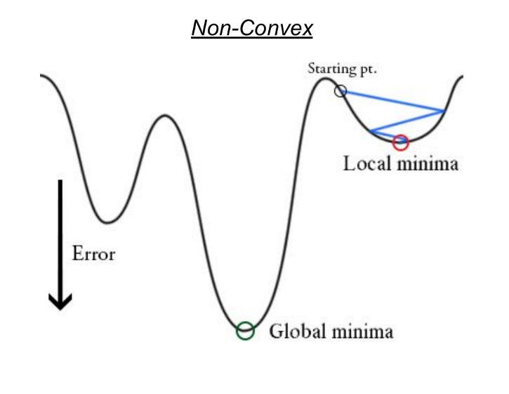

==========================
``Basics``
==========================

Andrew Ng has great introduction video on Youtube (deeplearing.ai). And `here
<https://www.analyticsvidhya.com/blog/2018/10/introduction-neural-networks-deep-learning/>`_ records notes of it.

Logistic Regression
===================

Problem Formulation
--------------------

Find a neuron

- Given input: :math:`x\in R^n`
- Want output: binary (Bernoulli) predication :math:`Y`

Transform to hypothesis of probability of :math:`Y=1|x`:

- Find Parameter: :math:`w\in R^n` and :math:`b\in R`
- :math:`y = P(Y=1|x)`
- Hypothesis is sigmoid equals to the probability :math:`\tilde{y}=\sigma(w^Tx+b)= y`

Alternative Notation:

- :math:`\theta=[b,w]^T`
- :math:`\tilde{y}=\sigma(\theta^Tx)`

Loss&Cost Function
-------------------

To understand how good is a model, we need to know the cost of the model, which is sum of losses, i.e., the difference between
sample data points and those predicated by the model. For instance, linear regression uses Loss Function :math:`L(\tilde{y_i}, y_i)=(\tilde{y_i}-y_i)^2/2`
and Cost Function :math:`J(w)=\sum^m_{i=1}(\tilde{y_i}-y_i)^2/2m`. And use Gradient Descent methods, we can find global minimum
cost.

source: https://medium.freecodecamp.org/understanding-gradient-descent-the-most-popular-ml-algorithm-a66c0d97307f

However, above cost function is non-convex with logistic regression's hypothesis, which we can see from the following chart (the 
difference between sigmoid and y). And global minimum cost might no longer be found.

.. plot::

  # Load matplotlib
  import matplotlib.pyplot as plt 
  plt.style.use('seaborn-whitegrid')
  import numpy as np
  fig = plt.figure()
  ax = plt.axes()
  ax.get_xaxis().set_ticks([])

  x = np.linspace(-5, 5, 100)
  sigmoid = 1/(1 + np.exp(-x))
  relu = np.maximum(0, x/4)
  li = 0.1*x+0.5
  ax.plot(x, sigmoid, label='Sigmoid 1/(1+e^-x)')
  ax.plot(x, relu, label='ReLu max(0,x)')
  ax.plot(x, li, label='y')
  plt.title(r'Activation Functions')
  plt.legend()

source: https://www.cs.ubc.ca/labs/lci/mlrg/slides/non_convex_optimization.pdf

Loss&Cost for Logistic Regression
----------------------------------

The loss function is defined as below (or :math:`L(\tilde{y_i}, y_i)=-ylog(\tilde{y_i})-(1-y)log(1-\tilde{y_i})`). And cost function is
:math:`J(w)=\sum^m_{i=1}L(\tilde{y},y_i)/m`. Now Gradient Descent can be used to optimize and get global minimum cost. Newton method
is another optimization way.

.. math::

  L(\tilde{y_i}, y_i)=\begin{cases}
  -log(\tilde{y_i}) | Y=1 \\
  -log(1-\tilde{y_i}) | Y=0 \\
  \end{cases}

Activation Function
-------------------

.. image:: neuron.png

Other than limit range of output, and resemble biological neural system, more importantly, non-linear activation function can
deal with problem which just not solveable by linear function. ReLU is more frequently used than Sigmoid and its loss function
resemble SVM's. Section 7.1.2 of Pattern Recognition and Machine Learning discusses more.

Regularization
--------------

To avoid overfitting, we may penalize :math:`w` by adding a function of :math:`w` to the cost function.

Computation Graph
-----------------

Back Propagation
-----------------