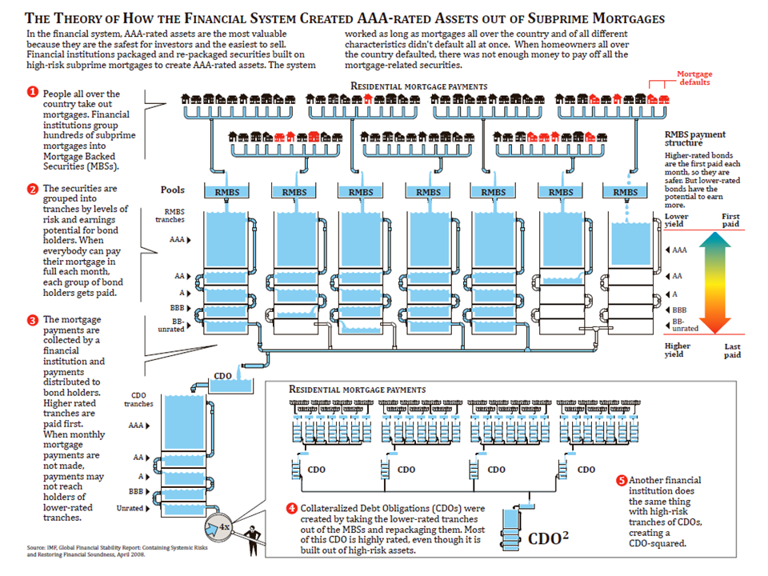

============================
``Big Short and Strategies``
============================

Derivative Market
=================

Subprime
--------

IMF's diagram for RMBS and CDO

CDO
---

Here is a simplied structure CDO product. Real product might have more economics like Maturity, Price, Yield, etc. 

=========  ======  =======  =======
Debt       Rating  Coupon   Tranche
=========  ======  =======  =======
Senior     AAA     6%       79%
Mezzanine  BBB     7.5%     20%
Junior     CCC     18%      10%
=========  ======  =======  =======

If the CDO default, Senior debt get repaid first thus with lower risk. Refer to `Wiki
<https://en.wikipedia.org/wiki/Collateralized_debt_obligation>`_ for more info.

Ant Financial
-------------

In 2020, before IPO, Ant Financial wanted regulator to ease the requirements, and got backfired.

- Bank finance service needs collateral, e.g., 30%. 
- With ABS, BASEL III requires 20%: AAA and AA. 50%: A-rated. 100%: BBB. 200%: BB-rated.

With above minimum capital requirement, 1B capital could be lend and repack the debt in structure similar with CDO table,
and sell to bank/ABS and get money back to lend again, and finally get several times leverage. 
Without above requirements, the leverage ratio could be many times more (e.g., 3B capital support 300B loan, 100x leverage).
Most (80%, 1.7T RMB) of Ant financial loan went to consumer loan and minority went to SMEs. Ant financial's consumer data 
might mitigate risk somewhat, but we can see it created a very high risky ecosystem.

Short Strategies
================

CDS Speculation
---------------

Burry and Paulson approached IB to make CDS market of mortagage, i.e., IB underwrite CDS and take risk of mortagate default.
They found IB significantly underestimate the risk, so the CDS should be bargain and default will make hundreds times profits
for them.

Short Senior CDO
----------------

CDO market was created and Jamie Mai found credit rating org gave senior tranche AA+ rating while it is based on high risk
debt as junior debt can't cover all lost large volume default if interest rate increases. Thus to short senior tranche of CDO
is a great deal.

Short Junior, Hedge with Senior
-------------------------------

Howie Hubler shorted junior tranche of CDO, which is more expensive comparing with Senior tranche. Due to high cost to pay,
he underwrote senior CDO to counterparties like Jamie and use its premium from Jamie to pay his junior tranche. His team created
9B loss in single transaction.

