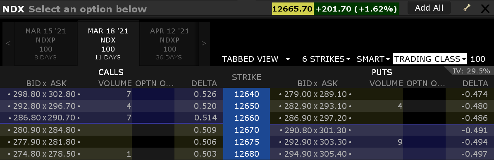
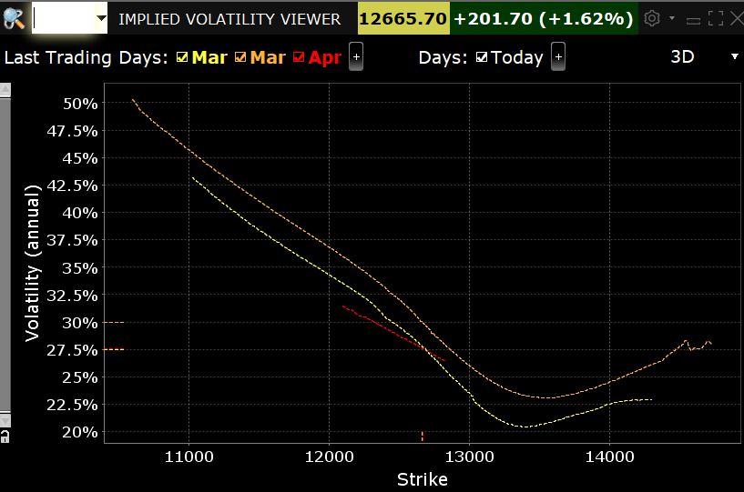
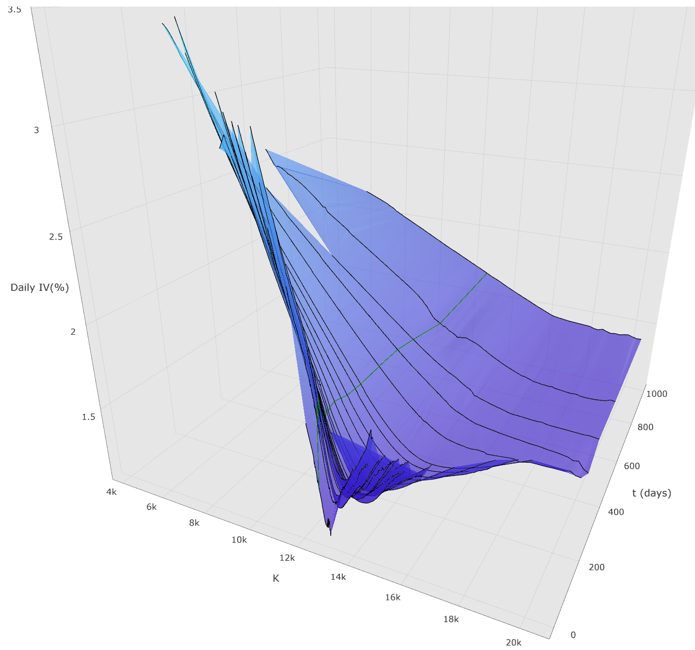

============================================================
``Life is Long Gamma``
============================================================

Option is the right, but obligation, to buy underlying instrument. A typical quote window is like:

It shows:

- Current underlying price (and change)
- Multiple Maturity Date
- Call and Put options' prices
- Quote by Delta (and corresponding Strike)

Black Scholes
-------------

To price an option, we might need:

- Underlying price :math:`S_t` at time :math:`t`, which is 0 now and maturity is :math:`T`
- :math:`K`: Strike 
- annual risk free rate (not in above quote window)
- :math:`\sigma`: historical volatility of underlying

Black Scholes Formula gives price of an option:

.. math::
  N(d_1)S_t - N(d_2) PresentValue(K)

:math:`N(x)` is the standard normal cumulative distribution function. :math:`N(d_1)` is :math:`\Delta` and :math:`N(d_2)` is dual delta.
The price is roughly, if the stock price random walk
results in the money, the value to execute it multiply the probability, couting hedge cost in the life cycle of the option.

Nassim Taleb states "Life is Long Gamma". What is its meaning? Basically life is full of option, if you want take option, you
long Gamma. Here I briefly go through it.

Greeks of Delta and Gamma
===========================

How Gamma :math:`\Gamma` play its role in option trading? Before talking about Delta :math:`\Gamma`, let's review concept of :math:`\Delta`, which is the first directive of option price with
respect to its underlying instrument. :math:`\Delta` is usually used a proxy of probability the option would expire in the money, which is 
actually dual delta, the first directive of option price with respect to strike price. 

.. math::
    \Delta = \frac{\partial V}{\partial S} 

    \Gamma = \frac{\partial \Delta}{\partial S}

To illustrate relationships among Call/Put options Delta, a rough plot is drawn using Sigmoid(). As Gramma is the first directive of Delta
with respect to underlying, it is drawn using np.gradient() function. Sigmoid is an important activation function used in neural network.

.. plot::

    # Load matplotlib
    import matplotlib.pyplot as plt 
    plt.style.use('seaborn-whitegrid')
    import numpy as np
    fig = plt.figure()
    ax = plt.axes()

    x = np.linspace(-10, 10, 100)
    call = 1/(1 + np.exp(-x/1.5))
    put = call - 1
    # use sin() gamma = np.sin(x/7 + 1.57) / 4
    dx = x[1] - x[0]
    gamma = np.gradient(put, dx)
    ax.plot(x, call, label='call $\Delta$')
    ax.plot(x, put, label='put $\Delta$')
    ax.plot(x, gamma, label='$\Gamma$ for both')
    plt.title(r'Call/Put $\Delta$ and $\Gamma$')
    plt.legend()

Long Option is Long Gamma
--------------------------

Some simple rules of greeks:

- Long option always get positive Gamma (Long Option is Long Gamma)
- Long Call/Short Put get positive Delta
- Short Call/Long Put get negative Delta
  
Delta Hedge
------------

As shown in option quote window, they could be quoted by delta, which represents the percentage of price changes of total
underlying. 1 option covers 100 underlying stocks. At first row 0.526 (52.6%) option means its profit is like 52.6%*100
underlying's profit. A portfolio's delta equals to sum of all assets' delta, e.g., Such a option' delta is 0.526*100=52.6. 
If someone holds this option, he could mitigate risk by short 52.6 underlying so that no matter what direction the underlying
move to, the total value of option and underlying won't change. This is so-called delta hedge.

Gamma Adjustment
----------------------

Gamma Sequenze
----------------------

Life is Long Gamma
----------------------

Convexity
==============

Formally Convexity concept arises from an obervation of cases in probability theory:

.. math::
    E[f(x)] > f(E[x])

An intuitive example is when you are driving a car with the speed (x), and f(x) is the hurt
you may suffer from when it bang into another car. 

Untility Function
=================

How risk aversion affect the convexity and 

