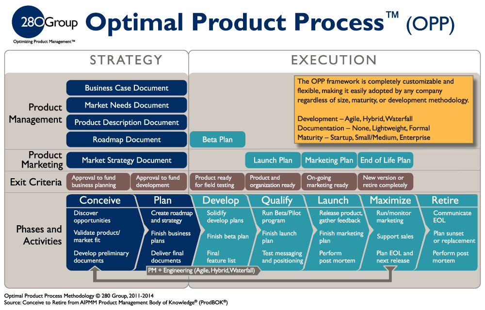

================================
``Basic of Product Management``
================================

To deliver successful product which help clients to generate value, and grow with client together.

Mindset
========

- Keep Learning and Adapt
- Shorten Iteration Cycle
- Deal with Org Inert

Factors
========
- TAM: Total Addressable Market
- Critical Mass
- Matthew effect
- Market Density
- Industrial/Supply Chain
- First-mover/Latecommer Advantage
- Increment and Stock
- High/Low Frequency
- Timing
- Michael Porter (Cost, Differentiation, Focus)
- Standard vs Effective

Methodolgy
==========

- PMF（Product Market Fit)
- Innovation Adoption Stages- 
- STP (Segmenting, Targeting, Positioning)
- 4P (Price, Product, Place, Promotion)
- 

Strategy
=========

- Business Development
- Resouce Planning
- Business Model
- Product Design
- Brand Marketing
- Operation
- Org Culture
- Technique Stack

Process
=======

